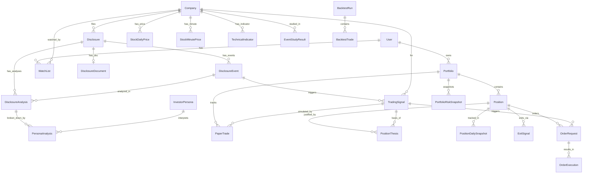

> 상위 문서: [비전](./00-vision-and-principles.md) · 작성: Agent Team

# 전체 DB 확장 설계 (Canonical Data Model)

> 이 문서는 **데이터 모델의 단일 진실 공급원(SSOT)** 이다.  
> 새 모델 추가·필드 변경·인덱스 조정 시 이 문서를 먼저 갱신한 뒤 마이그레이션을 작성한다.  
> 최종 수정일: 2026-06-02

---

## 1. 목적 & 범위

**목적:** 비전 7장에서 정의한 추가 모델 23종을 하나의 일관된 Prisma 스키마로 스케치한다.  
기존 자연키(`Disclosure.rcpNo`, `Company.corpCode`)와의 FK 정합을 보장하고,  
Phase별 마이그레이션 순서와 대용량 시계열 테이블 운영 전략을 함께 제공한다.

**포함:**
- 기존 모델(변경 없음) + 신규 23종 전체 Prisma 모델 스케치
- Enum 정의 (DisclosureEventType, SignalGrade, ExitAction, AITaskType, OrderStatus 등)
- ERD (Mermaid)
- Phase별 마이그레이션 순서 전략
- StockMinutePrice 파티셔닝 · 보존 정책

**제외:**
- 실제 마이그레이션 SQL 파일 (각 Phase 상세 문서에서 생성)
- 모바일 상태 관리 구조 (cc-engine-architecture 문서 담당)
- 개별 API 엔드포인트 상세 (각 Phase 문서 담당)

---

## 2. 현재 코드베이스 연결점

| 기존 모델 | 자연키 / PK | 신규 모델과의 연결 |
|-----------|-------------|-------------------|
| `Disclosure` | `rcpNo String @id` | DisclosureDocument, DisclosureEvent, DisclosureAnalysis, TradingSignal, EventStudyResult |
| `Company` | `corpCode String @id` | StockDailyPrice, StockMinutePrice, TechnicalIndicator, EventStudyResult, Portfolio |
| `User` | `id String @id (cuid)` | Portfolio, InvestorPersona |
| `WatchList` | `(userId, corpCode) @unique` | 관심 종목 필터링 기준 — 직접 FK 추가 없음 |

기존 모델은 **변경하지 않는다.** 새 모델이 기존 PK를 외래키로 참조하는 방향으로만 확장한다.

---

## 3. 선행 조건 & 의존성

```
Phase 1 (수집 안정화)
  └─ DisclosureCollectionLog

Phase 2 (원문 파싱)
  └─ DisclosureDocument  ← Disclosure.rcpNo

Phase 3 (이벤트 추출)
  └─ DisclosureEvent  ← Disclosure.rcpNo

Phase 4 (AI 분석)
  └─ DisclosureAnalysis ← Disclosure.rcpNo
  └─ InvestorPersona (정적 시드)
  └─ PersonaAnalysis ← DisclosureAnalysis + InvestorPersona
  └─ AIUsageLog

Phase 5 (시세)
  └─ StockDailyPrice ← Company.corpCode
  └─ StockMinutePrice ← Company.corpCode
  └─ TechnicalIndicator ← Company.corpCode

Phase 6 (Signal)
  └─ TradingSignal ← DisclosureEvent + StockDailyPrice

Phase 7 (Thesis)
  └─ Portfolio ← User
  └─ Position ← Portfolio + Company
  └─ PositionThesis ← Position + TradingSignal

Phase 8 (Exit)
  └─ PositionDailySnapshot ← Position
  └─ ExitSignal ← Position + PositionThesis
  └─ PortfolioRiskSnapshot ← Portfolio

Phase 9 (Event Study)
  └─ EventStudyResult ← Company + DisclosureEvent

Phase 10 (백테스트)
  └─ BacktestRun
  └─ BacktestTrade ← BacktestRun

Phase 12 (모의투자)
  └─ PaperTrade ← TradingSignal + Portfolio(paper)

Phase 13/14 (실거래)
  └─ OrderRequest ← Position + TradingSignal
  └─ OrderExecution ← OrderRequest
  └─ TradingAuditLog
```

---

## 4. 상세 설계

### 4-1. Enum 정의

```prisma
enum DisclosureEventType {
  SUPPLY_CONTRACT
  CONTRACT_CANCELLATION
  SHARE_BUYBACK
  SHARE_CANCELLATION
  DIVIDEND_INCREASE
  DIVIDEND_CUT
  PAID_IN_CAPITAL_INCREASE
  THIRD_PARTY_ALLOTMENT
  CB_ISSUANCE
  BW_ISSUANCE
  EARNINGS_SURPRISE
  EARNINGS_SHOCK
  MAJOR_SHAREHOLDER_CHANGE
  LAWSUIT
  AUDIT_OPINION_RISK
  TRADING_SUSPENSION
  DELISTING_RISK
  OTHER
}

enum EventPolarity {
  POSITIVE
  NEGATIVE
  MIXED
  NEUTRAL
}

enum SignalGrade {
  STRONG_BUY   // 80+
  BUY          // 60–79
  WATCH        // 30–59
  NEUTRAL      // -29~29
  AVOID        // -30-
}

enum ExitAction {
  HOLD
  WATCH
  REDUCE
  EXIT
  BLOCK_REBUY
}

enum PositionStatus {
  OPEN
  PARTIALLY_CLOSED
  CLOSED
}

enum OrderSide {
  BUY
  SELL
}

enum OrderStatus {
  PENDING_APPROVAL  // 사용자 승인 대기 (반자동)
  APPROVED
  REJECTED
  SUBMITTED         // 증권사 API 전송
  PARTIALLY_FILLED
  FILLED
  CANCELLED
  ERROR
}

enum AITaskType {
  DISCLOSURE_SUMMARY
  EVENT_CLASSIFICATION
  PERSONA_INTERPRETATION
  POSITION_THESIS
  EXIT_THESIS
  AMENDMENT_COMPARISON
}

enum AILevel {
  L0  // 미사용
  L1  // 저비용 (이벤트 분류만)
  L2  // 중간 (요약 + Persona)
  L3  // 고성능 (Thesis + 복잡 분석)
}

enum ParseStatus {
  PENDING
  SUCCESS
  PARTIAL
  FAILED
}

enum TradeMode {
  PAPER
  SEMI_AUTO
  AUTO
}
```

---

### 4-2. Phase 1 — 수집 로그

```prisma
// DisclosureCollectionLog — 수집 배치 실행 이력
model DisclosureCollectionLog {
  id            String   @id @default(cuid())
  startedAt     DateTime
  endedAt       DateTime?
  bgnDe         String   // 수집 대상 시작일 YYYYMMDD
  endDe         String   // 수집 대상 종료일 YYYYMMDD
  fetchedCount  Int      @default(0)  // DART API에서 받은 건수
  newCount      Int      @default(0)  // 신규 저장 건수
  skippedCount  Int      @default(0)  // 중복 스킵 건수
  failedCount   Int      @default(0)
  status        String   // "RUNNING" | "SUCCESS" | "PARTIAL" | "FAILED"
  errorMessage  String?
  triggeredBy   String   @default("SCHEDULER") // "SCHEDULER" | "MANUAL"

  @@index([startedAt])
  @@index([status])
  @@map("disclosure_collection_logs")
}
```

---

### 4-3. Phase 2 — 공시 원문

```prisma
// DisclosureDocument — 공시 원문 파싱 결과
model DisclosureDocument {
  rcpNo        String      @id  // FK → Disclosure.rcpNo (1:1)
  rawFilePath  String?          // S3/로컬 원문 파일 경로
  rawHtml      String?          // @db.Text 원본 HTML
  rawText      String?          // @db.Text 추출된 순수 텍스트
  parsedJson   Json?            // 표·key-value 구조화 결과
  charCount    Int?             // rawText 문자 수 (AI 비용 추정용)
  parseStatus  ParseStatus @default(PENDING)
  parseError   String?
  isAmendment  Boolean     @default(false)  // 정정공시 여부
  originalRcpNo String?         // 정정 시 원공시 rcpNo
  fetchedAt    DateTime    @default(now())
  parsedAt     DateTime?

  // Relations
  disclosure Disclosure @relation(fields: [rcpNo], references: [rcpNo])

  @@index([parseStatus])
  @@index([isAmendment])
  @@map("disclosure_documents")
}
```

---

### 4-4. Phase 3 — 이벤트 추출

```prisma
// DisclosureEvent — 공시에서 추출된 투자 이벤트 단위
model DisclosureEvent {
  id            String               @id @default(cuid())
  rcpNo         String               // FK → Disclosure.rcpNo
  corpCode      String               // FK → Company.corpCode (JOIN 최적화용 역정규화)
  eventType     DisclosureEventType
  polarity      EventPolarity        @default(NEUTRAL)
  keyMetrics    Json                 // 이벤트별 핵심 수치 JSON (비전 Phase 3 예시 참조)
  confidence    Float?               // Rule 추출 신뢰도 0.0~1.0
  extractedBy   String               @default("RULE")  // "RULE" | "AI_ASSISTED"
  eventDate     DateTime?            // 이벤트 발생 실효일 (계약일, 결의일 등)
  createdAt     DateTime             @default(now())

  // Relations
  disclosure      Disclosure           @relation(fields: [rcpNo], references: [rcpNo])
  company         Company              @relation(fields: [corpCode], references: [corpCode])
  disclosureAnalyses DisclosureAnalysis[]
  tradingSignals  TradingSignal[]
  eventStudyResults EventStudyResult[]

  @@index([rcpNo])
  @@index([corpCode])
  @@index([eventType])
  @@index([polarity])
  @@index([createdAt])
  @@map("disclosure_events")
}
```

---

### 4-5. Phase 4 — AI 분석

```prisma
// InvestorPersona — 투자 성향 정의 (정적 시드 4종)
model InvestorPersona {
  id           String   @id @default(cuid())
  code         String   @unique  // "VALUE" | "GROWTH" | "MOMENTUM" | "EVENT_DRIVEN"
  name         String
  description  String
  weightJson   Json     // 각 이벤트 타입별 기본 가중치

  // Relations
  personaAnalyses PersonaAnalysis[]

  @@map("investor_personas")
}

// DisclosureAnalysis — AI가 생성한 공시 분석 결과 (1 rcpNo당 1건)
model DisclosureAnalysis {
  id               String      @id @default(cuid())
  rcpNo            String      // FK → Disclosure.rcpNo
  eventId          String?     // FK → DisclosureEvent.id (특정 이벤트 기반 분석 시)
  aiLevel          AILevel
  taskType         AITaskType
  summary          String?     // @db.Text
  positiveFactors  Json?       // String[]
  negativeFactors  Json?       // String[]
  riskSentences    Json?       // String[]
  outputJson       Json        // AI 전체 응답 원문 저장
  modelId          String      // 사용한 LLM 모델 ID
  inputTokens      Int
  outputTokens     Int
  latencyMs        Int?
  createdAt        DateTime    @default(now())

  // Relations
  disclosure      Disclosure       @relation(fields: [rcpNo], references: [rcpNo])
  event           DisclosureEvent? @relation(fields: [eventId], references: [id])
  personaAnalyses PersonaAnalysis[]

  @@index([rcpNo])
  @@index([taskType])
  @@index([createdAt])
  @@map("disclosure_analyses")
}

// PersonaAnalysis — Persona별 공시 해석
model PersonaAnalysis {
  id           String   @id @default(cuid())
  analysisId   String   // FK → DisclosureAnalysis.id
  personaId    String   // FK → InvestorPersona.id
  view         String   // "POSITIVE" | "NEGATIVE" | "WATCH" | "NEUTRAL"
  reason       String   // @db.Text
  relevanceScore Float? // 0.0~1.0 (이 Persona에 얼마나 관련 있는 공시인가)

  // Relations
  analysis DisclosureAnalysis @relation(fields: [analysisId], references: [id], onDelete: Cascade)
  persona  InvestorPersona    @relation(fields: [personaId], references: [id])

  @@unique([analysisId, personaId])
  @@index([personaId])
  @@map("persona_analyses")
}

// AIUsageLog — AI 호출 비용 추적 (Phase 11 비용 통제의 원천 데이터)
// AI 금지 영역: 이 테이블로 집계된 비용 지표는 참고용. 호출 차단/허용은 Rule Engine이 결정.
model AIUsageLog {
  id            String      @id @default(cuid())
  taskType      AITaskType
  aiLevel       AILevel
  relatedId     String?     // rcpNo, positionId 등 연결 엔티티 ID
  modelId       String
  inputTokens   Int
  outputTokens  Int
  estimatedCost Float       // USD
  latencyMs     Int?
  success       Boolean
  errorMessage  String?
  calledAt      DateTime    @default(now())

  @@index([taskType])
  @@index([calledAt])
  @@index([aiLevel])
  @@map("ai_usage_logs")
}
```

---

### 4-6. Phase 5 — 시세·기술 지표

```prisma
// StockDailyPrice — 일봉 OHLCV (1차 소스: KRX 데이터마켓플레이스, 공기업)
model StockDailyPrice {
  id          String   @id @default(cuid())
  corpCode    String   // FK → Company.corpCode
  stockCode   String   // 종목코드 6자리 (역정규화)
  tradeDate   String   // YYYYMMDD
  open        Int
  high        Int
  low         Int
  close       Int
  volume      BigInt
  tradingValue BigInt  // 거래대금 (원)
  marketCap   BigInt?  // 시가총액
  foreignRatio Float?  // 외국인 보유 비율
  source      String   @default("KRX")  // 데이터 출처 (1차: KRX, 보완: 증권사 OpenAPI)

  // Relations
  company Company @relation(fields: [corpCode], references: [corpCode])

  @@unique([corpCode, tradeDate])
  @@index([corpCode, tradeDate])
  @@index([tradeDate])
  @@map("stock_daily_prices")
}

// StockMinutePrice — 분봉 OHLCV (대용량 — 파티셔닝 필수, 아래 별도 정책 참조)
model StockMinutePrice {
  id          BigInt   @id @default(autoincrement())  // 시계열 PK는 BIGINT auto
  corpCode    String   // FK → Company.corpCode
  stockCode   String
  tradeAt     DateTime // 분봉 시각 (UTC)
  open        Int
  high        Int
  low         Int
  close       Int
  volume      BigInt
  source      String   @default("KIS")

  @@index([corpCode, tradeAt])
  @@index([tradeAt])
  // 파티셔닝: PostgreSQL RANGE PARTITION BY tradeAt (월별)
  // 보존: 최근 6개월만 유지, 오래된 파티션 DROP
  @@map("stock_minute_prices")
}

// TechnicalIndicator — 사전 계산된 기술 지표 (일별 스냅샷)
model TechnicalIndicator {
  id            String   @id @default(cuid())
  corpCode      String   // FK → Company.corpCode
  tradeDate     String   // YYYYMMDD
  ma5           Float?
  ma20          Float?
  ma60          Float?
  ma120         Float?
  rsi14         Float?
  macdLine      Float?
  macdSignal    Float?
  macdHistogram Float?
  bbandsUpper   Float?
  bbandsMiddle  Float?
  bbandsLower   Float?
  atr14         Float?
  vwap          Float?
  volumeRatio20 Float?   // 20일 평균 대비 거래량 비율
  isNewHigh52w  Boolean  @default(false)
  isNewLow52w   Boolean  @default(false)
  priceVsMa20   Float?   // (close - ma20) / ma20 * 100

  // Relations
  company Company @relation(fields: [corpCode], references: [corpCode])

  @@unique([corpCode, tradeDate])
  @@index([corpCode, tradeDate])
  @@map("technical_indicators")
}
```

---

### 4-7. Phase 6 — 매수 Signal

```prisma
// TradingSignal — Buy/Sell 신호 생성 결과
// AI 금지: 이 테이블의 signal 값은 참고용. 최종 주문 승인·수량·손익 하드룰은 Risk Engine 전담.
model TradingSignal {
  id              String      @id @default(cuid())
  corpCode        String      // FK → Company.corpCode
  eventId         String?     // FK → DisclosureEvent.id
  rcpNo           String?     // FK → Disclosure.rcpNo (빠른 조회용)
  personaCode     String?     // 적용 Persona ("VALUE" | "GROWTH" | "MOMENTUM" | "EVENT_DRIVEN")
  signalGrade     SignalGrade
  buyScore        Float       // 합산 점수
  scoreBreakdown  Json        // 각 구성 요소별 점수 상세
  entryConditions Json        // String[] — 진입 조건 체크리스트
  riskFactors     Json        // String[] — 리스크 요인
  suggestedEntry  Float?      // 제안 진입 가격
  suggestedStop   Float?      // 제안 손절 가격
  suggestedTarget Float?      // 제안 목표 가격
  isBacktest      Boolean     @default(false)
  expiresAt       DateTime?   // 신호 유효 시각 (당일 장마감 등)
  createdAt       DateTime    @default(now())

  // Relations
  company         Company          @relation(fields: [corpCode], references: [corpCode])
  event           DisclosureEvent? @relation(fields: [eventId], references: [id])
  positionTheses  PositionThesis[]
  orderRequests   OrderRequest[]
  paperTrades     PaperTrade[]

  @@index([corpCode])
  @@index([signalGrade])
  @@index([createdAt])
  @@index([expiresAt])
  @@map("trading_signals")
}
```

**Buy Score 공식 (의사코드):**

```
BuyScore =
  disclosureEventScore(eventType, keyMetrics)  // 0~30
  + quantScore(salesRatio, dilution, etc.)      // 0~20
  + personaFitScore(persona, eventType)         // 0~15
  + eventStudyScore(historicalStats)            // 0~15
  + chartScore(technicalIndicator)              // 0~15
  + volumeScore(volumeRatio20, tradingValue)    // 0~10
  + marketSentimentScore(indexReturn)           // 0~10
  - riskPenalty(managedStock, suspendedTrading, recentSurge, lowLiquidity)  // 0~50

신호 등급 매핑:
  score >= 80 → STRONG_BUY
  score >= 60 → BUY
  score >= 30 → WATCH
  score >= -29 → NEUTRAL
  else → AVOID
```

---

### 4-8. Phase 7 — Position Thesis

```prisma
// Portfolio — 사용자 포트폴리오 (실거래/모의투자 분리)
model Portfolio {
  id          String     @id @default(cuid())
  userId      String     // FK → User.id
  name        String
  mode        TradeMode  // PAPER | SEMI_AUTO | AUTO
  currency    String     @default("KRW")
  cashBalance Float      @default(0)
  isActive    Boolean    @default(true)
  createdAt   DateTime   @default(now())
  updatedAt   DateTime   @updatedAt

  // Relations
  user                User                    @relation(fields: [userId], references: [id])
  positions           Position[]
  riskSnapshots       PortfolioRiskSnapshot[]
  paperTrades         PaperTrade[]

  @@index([userId])
  @@index([mode])
  @@map("portfolios")
}

// Position — 보유 포지션 (종목당 1개 오픈 포지션)
model Position {
  id               String         @id @default(cuid())
  portfolioId      String         // FK → Portfolio.id
  corpCode         String         // FK → Company.corpCode
  stockCode        String
  status           PositionStatus @default(OPEN)
  avgEntryPrice    Float
  currentShares    Int
  initialShares    Int
  totalBuyCost     Float          // 총 매입 금액 (수수료 포함)
  realizedPnl      Float          @default(0)  // 확정 손익
  openedAt         DateTime
  closedAt         DateTime?
  updatedAt        DateTime       @updatedAt

  // Relations
  portfolio        Portfolio        @relation(fields: [portfolioId], references: [id])
  company          Company          @relation(fields: [corpCode], references: [corpCode])
  positionTheses   PositionThesis[]
  dailySnapshots   PositionDailySnapshot[]
  exitSignals      ExitSignal[]
  orderRequests    OrderRequest[]

  @@unique([portfolioId, corpCode, status])  // 동일 포트폴리오 내 중복 오픈 포지션 방지
  @@index([portfolioId])
  @@index([corpCode])
  @@index([status])
  @@map("positions")
}

// PositionThesis — 진입 사유·훼손 조건·청산 룰 저장
// AI 금지: stopLossHardPct(하드스탑 %)·maxWeight(포트폴리오 한도)는 AI가 설정·수정 불가.
model PositionThesis {
  id                 String   @id @default(cuid())
  positionId         String   // FK → Position.id
  signalId           String?  // FK → TradingSignal.id (근거 Signal)
  rcpNo              String?  // FK → Disclosure.rcpNo (근거 공시)
  personaCode        String?
  entryReason        String   // @db.Text
  initialThesis      Json     // String[] — 핵심 매수 논리 목록
  invalidConditions  Json     // String[] — 훼손 조건 목록
  stopLossHardPct    Float    // 하드스탑 비율 (예: -7.0) — AI 수정 금지
  takeProfitPct      Float?   // 1차 목표 수익률
  trailingStopPct    Float?   // 트레일링 스탑 비율
  thesisStopNote     String?  // 논리 훼손 판단 기준 텍스트
  maxWeightPct       Float?   // 포트폴리오 내 최대 비중 — AI 수정 금지
  targetHoldDays     Int?     // 목표 보유 기간 (일)
  isActive           Boolean  @default(true)
  createdAt          DateTime @default(now())
  updatedAt          DateTime @updatedAt

  // Relations
  position Position       @relation(fields: [positionId], references: [id])
  signal   TradingSignal? @relation(fields: [signalId], references: [id])

  @@index([positionId])
  @@index([isActive])
  @@map("position_theses")
}
```

---

### 4-9. Phase 8 — Portfolio Tracking & Exit Engine

```prisma
// PositionDailySnapshot — 보유 포지션 일별 스냅샷 (추이 추적)
model PositionDailySnapshot {
  id              String   @id @default(cuid())
  positionId      String   // FK → Position.id
  snapshotDate    String   // YYYYMMDD
  closePrice      Float
  shares          Int
  marketValue     Float
  unrealizedPnl   Float
  unrealizedPct   Float
  exitScore       Float?   // 당일 Exit Score
  exitAction      ExitAction?

  // Relations
  position Position @relation(fields: [positionId], references: [id])

  @@unique([positionId, snapshotDate])
  @@index([positionId])
  @@index([snapshotDate])
  @@map("position_daily_snapshots")
}

// ExitSignal — 매도/축소 신호
// AI 금지: exitAction 결정 최종 권한은 Risk Engine. AI는 exitNote 생성만 보조.
model ExitSignal {
  id              String     @id @default(cuid())
  positionId      String     // FK → Position.id
  thesisId        String?    // FK → PositionThesis.id
  exitScore       Float
  exitAction      ExitAction
  scoreBreakdown  Json       // 구성 요소별 점수
  triggers        Json       // String[] — 발동 조건 (손절/논리훼손/차트훼손 등)
  exitNote        String?    // AI 보조: 매도 이유 자연어 요약 (@db.Text)
  suggestedQty    Int?       // 제안 수량 — AI 수정 금지, Risk Engine 산출
  executedAt      DateTime?  // 실제 실행 시각
  createdAt       DateTime   @default(now())

  // Relations
  position Position        @relation(fields: [positionId], references: [id])

  @@index([positionId])
  @@index([exitAction])
  @@index([createdAt])
  @@map("exit_signals")
}

// PortfolioRiskSnapshot — 포트폴리오 수준 리스크 일별 스냅샷
// AI 금지: maxDrawdownLimit·dailyLossLimit은 하드룰. AI가 참조하되 변경 금지.
model PortfolioRiskSnapshot {
  id                   String   @id @default(cuid())
  portfolioId          String   // FK → Portfolio.id
  snapshotDate         String   // YYYYMMDD
  totalMarketValue     Float
  cashBalance          Float
  totalPnl             Float
  dailyPnl             Float
  weeklyPnl            Float?
  maxDrawdown          Float    // 최고점 대비 낙폭
  concentrationRisk    Json     // { byStock: [...], bySector: [...], byEventType: [...] }
  openPositionCount    Int
  heaviestPosition     String?  // 가장 비중 큰 종목 corpCode

  // Relations
  portfolio Portfolio @relation(fields: [portfolioId], references: [id])

  @@unique([portfolioId, snapshotDate])
  @@index([portfolioId])
  @@index([snapshotDate])
  @@map("portfolio_risk_snapshots")
}
```

**Exit Score 공식 (의사코드):**

```
ExitScore =
  lossRisk(unrealizedPct, hardStopPct, atr)         // 0~30
  + thesisInvalidation(amendmentDetected, cancelDetected, earningsMiss)  // 0~25
  + chartDamage(below_ma20, belowVwap, belowSwingLow, largeBearBar)      // 0~20
  + disclosureRisk(newNegativeEvent, auditRisk)       // 0~15
  + overWeight(positionWeightPct, sectorWeightPct)   // 0~10
  + timeDecay(heldDays > targetHoldDays)             // 0~10
  - positiveM omentum(priceAboveMa5, volumeSurge)    // 0~10

액션 매핑:
  score >= 90 → BLOCK_REBUY (즉시 리스크 매도)
  score >= 70 → EXIT
  score >= 50 → REDUCE
  score >= 30 → WATCH
  else → HOLD
```

---

### 4-10. Phase 9 — Event Study

```prisma
// EventStudyResult — 이벤트 타입별 과거 통계 반응
model EventStudyResult {
  id              String              @id @default(cuid())
  eventType       DisclosureEventType
  subCategory     String?             // 공급계약 salesRatio 구간 등
  corpCode        String?             // FK → Company.corpCode (종목별 통계 시)
  sampleSize      Int
  // 수익률 통계 (시장 대비 초과수익 기준)
  arD1Mean        Float?  // D+1 평균 초과수익률
  arD3Mean        Float?
  arD5Mean        Float?
  arD20Mean       Float?
  winRateD5       Float?  // D+5 기준 상승 확률
  crashRateD5     Float?  // D+5 급락(-5% 이하) 확률
  avgMaxDrawdown  Float?
  volumeRatioD1   Float?  // D+1 거래량 증가율
  statsJson       Json    // 전체 통계 원본
  computedAt      DateTime @default(now())

  // Relations
  company Company? @relation(fields: [corpCode], references: [corpCode])

  @@unique([eventType, subCategory, corpCode])
  @@index([eventType])
  @@map("event_study_results")
}
```

---

### 4-11. Phase 10 — 백테스트

```prisma
// BacktestRun — 백테스트 실행 단위
model BacktestRun {
  id              String   @id @default(cuid())
  name            String
  description     String?
  startDate       String   // YYYYMMDD
  endDate         String
  initialCash     Float
  eventTypes      Json     // DisclosureEventType[]
  personaCodes    Json     // String[]
  strategyParams  Json     // Buy/Exit Score 임계값, 비중 룰 등
  // 성과 지표
  totalReturn     Float?
  annualReturn    Float?
  winRate         Float?
  avgWin          Float?
  avgLoss         Float?
  profitFactor    Float?
  maxDrawdown     Float?
  sharpeRatio     Float?
  tradeCount      Int?
  resultJson      Json?    // 전체 결과 원본
  status          String   @default("PENDING")  // PENDING | RUNNING | DONE | FAILED
  createdAt       DateTime @default(now())
  completedAt     DateTime?

  // Relations
  trades BacktestTrade[]

  @@index([status])
  @@index([createdAt])
  @@map("backtest_runs")
}

// BacktestTrade — 백테스트 개별 거래
model BacktestTrade {
  id            String   @id @default(cuid())
  runId         String   // FK → BacktestRun.id
  corpCode      String
  eventType     DisclosureEventType?
  entryDate     String   // YYYYMMDD
  entryPrice    Float
  exitDate      String?
  exitPrice     Float?
  shares        Int
  pnl           Float?
  pnlPct        Float?
  exitReason    String?  // "STOP_LOSS" | "TAKE_PROFIT" | "THESIS_INVALID" | "TIME_LIMIT" | "BACKTEST_END"
  signalScore   Float?

  // Relations
  run BacktestRun @relation(fields: [runId], references: [id], onDelete: Cascade)

  @@index([runId])
  @@index([corpCode])
  @@map("backtest_trades")
}
```

---

### 4-12. Phase 12 — 모의투자

```prisma
// PaperTrade — 모의투자 가상 거래
model PaperTrade {
  id              String     @id @default(cuid())
  portfolioId     String     // FK → Portfolio.id (mode=PAPER)
  signalId        String?    // FK → TradingSignal.id
  corpCode        String
  side            OrderSide
  shares          Int
  simulatedPrice  Float      // 체결 시뮬레이션 가격 (시가/종가 등)
  simulatedAt     DateTime
  pnl             Float?
  pnlPct          Float?
  closedAt        DateTime?
  exitReason      String?
  aiCostUsd       Float?     // 이 거래 관련 AI 비용 합산

  // Relations
  portfolio Portfolio     @relation(fields: [portfolioId], references: [id])
  signal    TradingSignal? @relation(fields: [signalId], references: [id])

  @@index([portfolioId])
  @@index([corpCode])
  @@index([simulatedAt])
  @@map("paper_trades")
}
```

---

### 4-13. Phase 13/14 — 실거래 주문·감사 로그

```prisma
// OrderRequest — 사용자 승인 대기 주문안 (반자동) 또는 자동 주문 후보
// AI 금지: shares(주문 수량)·orderSide·limitPrice는 AI 산출 금지.
//          Risk Engine이 계산한 값을 사용자 또는 자동 승인 후 전송.
model OrderRequest {
  id              String      @id @default(cuid())
  portfolioId     String      // FK → Portfolio.id
  positionId      String?     // FK → Position.id
  signalId        String?     // FK → TradingSignal.id
  corpCode        String
  stockCode       String
  side            OrderSide
  requestedShares Int         // Risk Engine 산출 — AI 수정 금지
  limitPrice      Float?      // 지정가 (null=시장가)
  stopPrice       Float?      // 스탑 가격
  mode            TradeMode
  status          OrderStatus @default(PENDING_APPROVAL)
  riskCheckJson   Json?       // Risk Engine 사전 검증 결과
  approvedBy      String?     // 사용자 ID 또는 "AUTO"
  approvedAt      DateTime?
  rejectedReason  String?
  expiresAt       DateTime?
  createdAt       DateTime    @default(now())

  // Relations
  portfolio  Portfolio      @relation(fields: [portfolioId], references: [id])
  position   Position?      @relation(fields: [positionId], references: [id])
  signal     TradingSignal? @relation(fields: [signalId], references: [id])
  executions OrderExecution[]

  @@index([portfolioId])
  @@index([status])
  @@index([createdAt])
  @@map("order_requests")
}

// OrderExecution — 증권사 API 체결 결과
model OrderExecution {
  id              String   @id @default(cuid())
  requestId       String   // FK → OrderRequest.id
  brokerOrderId   String?  // 증권사 주문번호
  filledShares    Int
  filledPrice     Float
  commission      Float    @default(0)
  tax             Float    @default(0)
  netAmount       Float    // filledShares * filledPrice - commission - tax
  filledAt        DateTime
  source          String   @default("KIS")  // 증권사 구분

  // Relations
  request OrderRequest @relation(fields: [requestId], references: [id])

  @@index([requestId])
  @@index([filledAt])
  @@map("order_executions")
}

// TradingAuditLog — 모든 주문·포지션 변경 이력 (불변 감사 로그)
// 이 테이블은 INSERT ONLY. UPDATE/DELETE 금지.
model TradingAuditLog {
  id          String   @id @default(cuid())
  entityType  String   // "ORDER_REQUEST" | "ORDER_EXECUTION" | "POSITION" | "EXIT_SIGNAL"
  entityId    String
  action      String   // "CREATED" | "APPROVED" | "REJECTED" | "SUBMITTED" | "FILLED" | "CANCELLED"
  actorType   String   // "USER" | "SYSTEM" | "AUTO_ENGINE"
  actorId     String?  // userId 또는 시스템 식별자
  beforeJson  Json?    // 변경 전 상태
  afterJson   Json?    // 변경 후 상태
  note        String?
  recordedAt  DateTime @default(now())

  @@index([entityType, entityId])
  @@index([recordedAt])
  @@map("trading_audit_logs")
}
```

---

## 5. ERD (Mermaid)



---

## 6. 작업 분해

### Phase 1 (수집 안정화) 마이그레이션
- [ ] `DisclosureCollectionLog` 모델 추가 마이그레이션 작성
- [ ] `npx prisma migrate dev --name add_collection_log` 실행 검증

### Phase 2 (원문 파싱) 마이그레이션
- [ ] `ParseStatus` enum 추가
- [ ] `DisclosureDocument` 모델 추가 (rcpNo @id, Disclosure 1:1 관계)
- [ ] `Disclosure` 모델에 `@@relation` 역참조 추가

### Phase 3 (이벤트 추출) 마이그레이션
- [ ] `DisclosureEventType` enum 추가
- [ ] `EventPolarity` enum 추가
- [ ] `DisclosureEvent` 모델 추가 (rcpNo, corpCode FK)
- [ ] `Company` 역참조 추가

### Phase 4 (AI 분석) 마이그레이션
- [ ] `AITaskType`, `AILevel` enum 추가
- [ ] `InvestorPersona` 모델 + 시드 스크립트 (4종)
- [ ] `DisclosureAnalysis` 모델
- [ ] `PersonaAnalysis` 모델
- [ ] `AIUsageLog` 모델

### Phase 5 (시세) 마이그레이션
- [ ] `StockDailyPrice` 모델
- [ ] `TechnicalIndicator` 모델
- [ ] `StockMinutePrice` 모델 (BIGINT PK)
- [ ] PostgreSQL 파티션 DDL 스크립트 별도 작성 (Prisma migrate 이후 수동 적용)

### Phase 6 (Signal) 마이그레이션
- [ ] `SignalGrade` enum 추가
- [ ] `TradingSignal` 모델

### Phase 7/8 (Thesis·Exit) 마이그레이션
- [ ] `TradeMode`, `PositionStatus`, `ExitAction` enum 추가
- [ ] `Portfolio`, `Position`, `PositionThesis` 모델
- [ ] `PositionDailySnapshot`, `ExitSignal`, `PortfolioRiskSnapshot` 모델

### Phase 9 (Event Study) 마이그레이션
- [ ] `EventStudyResult` 모델

### Phase 10 (백테스트) 마이그레이션
- [ ] `BacktestRun`, `BacktestTrade` 모델

### Phase 12 (모의투자) 마이그레이션
- [ ] `PaperTrade` 모델
- [ ] `Portfolio.mode` PAPER 시드 생성 로직

### Phase 13/14 (실거래) 마이그레이션
- [ ] `OrderSide`, `OrderStatus` enum 추가
- [ ] `OrderRequest`, `OrderExecution`, `TradingAuditLog` 모델
- [ ] `TradingAuditLog` INSERT-ONLY 정책 Trigger or Application-level 강제

---

## 7. AI 사용 정책

| 모델 / 필드 | AI 허용 범위 | AI 금지 사항 |
|-------------|-------------|-------------|
| `DisclosureAnalysis.outputJson` | AI가 직접 채우는 유일한 필드군 | — |
| `ExitSignal.exitNote` | 매도 이유 자연어 요약 보조 | `exitAction` 결정, `suggestedQty` 산출 |
| `PositionThesis.entryReason`, `initialThesis` | AI Thesis 생성 | `stopLossHardPct`, `maxWeightPct` 수정 |
| `TradingSignal.buyScore`, `entryConditions` | AI가 scoreBreakdown 일부 기여 | 최종 주문 승인, 주문 수량 |
| `OrderRequest.requestedShares`, `limitPrice` | AI 관여 금지 | Risk Engine + 사용자 승인만 |
| `PortfolioRiskSnapshot.maxDrawdown` | 참조 가능 | 한도 변경 금지 |

---

## 8. 비용·성능 고려사항

### StockMinutePrice 파티셔닝 전략

```sql
-- Prisma migrate 이후 수동 적용
-- 기존 테이블을 파티션 테이블로 전환 (운영 전 적용 권장)
CREATE TABLE stock_minute_prices_y2026m01 PARTITION OF stock_minute_prices
  FOR VALUES FROM ('2026-01-01') TO ('2026-02-01');

-- 보존 정책: 최근 6개월 파티션만 유지
-- 매월 1일 cron: 7개월 이전 파티션 DROP
DROP TABLE IF EXISTS stock_minute_prices_y2025m05;
```

**예상 데이터 규모:**
- 관심 종목 50개 기준, 분봉 1건당 ~120 byte
- 1일 8시간 × 50 종목 = 24,000 건/일
- 6개월 = 약 430만 건 → 약 500 MB

**인덱스 전략:**
- `(corpCode, tradeAt)` 복합 인덱스 — 종목별 최근 분봉 조회
- 파티션 프루닝 활용 → `WHERE tradeAt BETWEEN` 필수

**StockDailyPrice:**
- 50 종목 × 250 거래일 × 10년 = 125,000 건 → 경량, 파티셔닝 불필요

**TechnicalIndicator:**
- StockDailyPrice와 동일 규모, `(corpCode, tradeDate)` UNIQUE 인덱스로 충분

**AIUsageLog 주의:**
- 공시당 호출 1~3회 기준, 월 수백~수천 건 → 경량
- 월별 집계 쿼리(`GROUP BY DATE_TRUNC('month', calledAt)`) 성능용 `calledAt` 인덱스

---

## 9. 리스크 & 엣지 케이스

| 리스크 | 대응 |
|--------|------|
| `rcpNo` 정정공시 시 원공시와 FK 충돌 | `DisclosureDocument.originalRcpNo` nullable, 정정 시 새 rcpNo로 신규 삽입 |
| StockMinutePrice 파티션 DROP 시 데이터 손실 | 6개월 이전 분봉은 S3 아카이브 후 DROP |
| `PositionThesis` stopLossHardPct AI 우회 시도 | Application layer: ThesisService에서 hardStop 필드 업데이트 권한 Role 검사 강제 |
| OrderRequest 동일 종목 중복 주문 | `(portfolioId, corpCode, status=PENDING_APPROVAL)` 유니크 제약 고려 |
| BacktestTrade corpCode FK — 과거 상폐 종목 | corpCode FK nullable 또는 Company에 `delistedAt` 필드 추가 |
| TradingAuditLog 변경 방지 | DB-level Trigger `BEFORE UPDATE/DELETE RAISE EXCEPTION` |
| 증권사 API 오류 시 OrderExecution 미생성 | OrderRequest.status = ERROR + TradingAuditLog 기록 후 알림 발송 |
| PersonaAnalysis 시드 누락 | DB 시드에 4종 InvestorPersona 레코드 필수 포함, CI seed 체크 |

---

## 10. 완료 기준 (DoD)

이 문서가 "완료" 상태가 되려면:

- [ ] 비전 7장의 23개 모델 모두 이 문서에 스케치됨 (현재 완료)
- [ ] 각 Phase 상세 문서에서 실제 마이그레이션 파일 생성 완료
- [ ] `npx prisma validate` 통과 (각 Phase 마이그레이션 적용 후)
- [ ] 기존 모델(`Disclosure`, `Company`, `User` 등) 데이터 손실 없이 마이그레이션 완료
- [ ] `StockMinutePrice` 파티션 DDL 스크립트 `backend/prisma/sql/` 경로에 저장
- [ ] `InvestorPersona` 시드 4종 `backend/prisma/seed.ts`에 추가
- [ ] AI 금지 필드(`stopLossHardPct`, `maxWeightPct`, `requestedShares`, `limitPrice`)에 코드 레벨 접근 제한 구현 확인
- [ ] `TradingAuditLog` INSERT-ONLY 정책 구현 (Trigger 또는 Service layer) 확인
- [ ] 이 문서가 가장 최신 스키마 반영 — Phase 문서와 불일치 발견 시 이 문서 우선으로 통일
