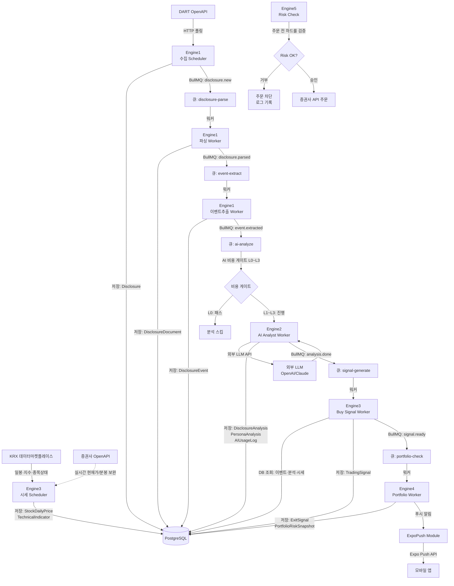

> 상위 문서: [비전](./00-vision-and-principles.md) · 작성: Agent Team

# 횡단 설계: 5개 엔진 아키텍처

> 작성일: 2026-06-02 · 상태: 설계 초안

---

## 1. 목적 & 범위

### 목적

공시 알림 MVP(NestJS 모놀리스)를 **5개 독립 엔진**으로 논리적으로 분리하고, 각 엔진의 NestJS 모듈 경계·데이터 소유권·비동기 큐 위치·AI 사용 등급을 확정한다.

### 포함

- 5개 엔진의 NestJS 모듈 매핑 및 서비스/컨트롤러 시그니처 스케치
- 엔진 간 데이터 흐름 (mermaid 다이어그램)
- 동기 vs 비동기(BullMQ 큐) 경계 결정
- 워커 프로세스 분리 방안 (수집/분석/시세/체결)
- 각 Prisma 모델의 엔진 소유권 매핑
- AI 배치 매핑 테이블 (필수/보조/금지)
- 배포 토폴로지 제안 (ECS Fargate 서비스 분리)
- 기존 scheduler/dart-api/expo-push 모듈의 흡수·확장 경로

### 제외

- Phase별 세부 구현(각 phase-NN 문서 참조)
- Prisma 모델 전체 필드 정의(cc-data-model.md 담당)
- 증권사 API 구체 연동(Phase 13-14 문서 담당)

---

## 2. 현재 코드베이스 연결점

현재 존재하는 NestJS 모듈(흡수 대상):

| 현재 모듈 | 파일 위치 | 5개 엔진 중 귀속 |
|-----------|-----------|-----------------|
| `SchedulerModule` | `src/scheduler/` | Engine 1 (확장) |
| `DartApiModule` | `src/dart-api/` | Engine 1 (확장) |
| `DisclosuresModule` | `src/disclosures/` | Engine 1 (확장) |
| `ExpoPushModule` | `src/expo-push/` | 알림 횡단 서비스 (독립 유지) |
| `CompaniesModule` | `src/companies/` | 공통 참조 (독립 유지) |
| `WatchlistModule` | `src/watchlist/` | Engine 4 보조 (독립 유지) |
| `NotificationSettingsModule` | `src/notification-settings/` | 알림 횡단 (독립 유지) |
| `NotificationsModule` | `src/notifications/` | 알림 횡단 (독립 유지) |
| `UsersModule` / `AuthModule` | `src/users/`, `src/auth/` | 공통 인증 (독립 유지) |
| `PrismaModule` | `src/prisma/` | 공통 DB (독립 유지) |

**자연키 정합 기준:**
- `Disclosure.rcpNo` (PK, String) — 모든 신규 분석 모델의 FK 루트
- `Company.corpCode` (PK, String) — 시세·포트폴리오 모델의 FK 루트

---

## 3. 선행 조건 & 의존성

| 의존 항목 | 설명 |
|-----------|------|
| PostgreSQL 14+ | BullMQ Job 대기열 또는 Redis 별도 구성 |
| Redis (신규) | BullMQ 큐 브로커 — Engine 1·2·3 비동기 작업 |
| 외부 LLM API | Engine 2 (OpenAI/Claude API). AI 비용 게이트(L0~L3) 구현 후 호출 |
| KRX 데이터마켓플레이스 (공기업) | Engine 3 시세 1차 소스 — 일봉·지수·종목상태. Phase 5 |
| 증권사 OpenAPI (KIS 등) | Engine 3 실시간 현재가/분봉 *보완* + Engine 5 주문 체결. Phase 6 후반~13 |
| DART OpenAPI | 현재 사용 중. Engine 1이 계속 소유 |

---

## 4. 상세 설계

### 4-1. 5개 엔진 → NestJS 모듈 매핑

```
src/
├── engine1-disclosure/          ← Disclosure Intelligence Engine
│   ├── collection/              (기존 scheduler + dart-api 흡수·확장)
│   │   ├── collection.service.ts
│   │   └── collection.scheduler.ts
│   ├── parsing/
│   │   └── parsing.service.ts
│   ├── event-extraction/
│   │   └── event-extraction.service.ts
│   └── disclosure-intelligence.module.ts
│
├── engine2-ai-analyst/          ← AI Analyst Engine
│   ├── tasks/
│   │   ├── summary.task.ts
│   │   ├── event-classification.task.ts
│   │   ├── persona-interpretation.task.ts
│   │   └── position-thesis.task.ts
│   ├── cost-gate/
│   │   └── ai-cost-gate.service.ts
│   ├── usage-log/
│   │   └── ai-usage-log.service.ts
│   └── ai-analyst.module.ts
│
├── engine3-quant-market/        ← Quant & Market Engine
│   ├── market-data/
│   │   ├── market-data.service.ts   (KIS OpenAPI 연동)
│   │   └── market-data.scheduler.ts
│   ├── indicators/
│   │   └── technical-indicator.service.ts
│   ├── event-study/
│   │   └── event-study.service.ts
│   ├── buy-signal/
│   │   └── buy-signal.service.ts
│   └── quant-market.module.ts
│
├── engine4-portfolio-exit/      ← Portfolio & Exit Engine
│   ├── portfolio/
│   │   └── portfolio.service.ts
│   ├── position/
│   │   └── position.service.ts
│   ├── thesis/
│   │   └── position-thesis.service.ts
│   ├── exit-signal/
│   │   └── exit-signal.service.ts
│   ├── tracking/
│   │   └── portfolio-tracking.scheduler.ts  (하루 3회)
│   └── portfolio-exit.module.ts
│
├── engine5-trading-risk/        ← Trading & Risk Engine
│   ├── risk-check/
│   │   └── risk-check.service.ts
│   ├── paper-trade/
│   │   └── paper-trade.service.ts
│   ├── order/
│   │   └── order.service.ts
│   ├── execution/
│   │   └── execution.service.ts
│   └── trading-risk.module.ts
│
├── common/                      ← 기존 유지 + 확장
│   ├── queues/
│   │   └── queue.constants.ts   (큐 이름 상수)
│   └── ...
├── scheduler/                   ← 기존 → Engine 1으로 이관 또는 래핑
├── dart-api/                    ← 기존 → Engine 1으로 이관
├── expo-push/                   ← 기존 유지 (알림 횡단 서비스)
└── ...
```

---

### 4-2. 엔진 간 데이터 흐름 (전체 파이프라인)



---

### 4-3. 동기 vs 비동기 처리 경계

| 처리 유형 | 방식 | 위치 | 이유 |
|-----------|------|------|------|
| DART 공시 수집 | **Cron(동기)** + BullMQ 발행 | Engine 1 Scheduler | 순서 보장, 중복 락 필요 |
| 공시 원문 파싱 | **BullMQ 컨슈머(비동기)** | Engine 1 Parse Worker | HTML 파싱 CPU-바운드, 병렬 처리 |
| 이벤트 수치 추출 | **BullMQ 컨슈머(비동기)** | Engine 1 Event Worker | 파싱 완료 후 순차 의존 |
| AI 분석 | **BullMQ 컨슈머(비동기)** | Engine 2 AI Worker | LLM API 지연 수십 초, 배압 필요 |
| 시세 수집 | **Cron(동기)** | Engine 3 Market Scheduler | 장중 1분/일봉 장마감 후 |
| 기술지표 계산 | **BullMQ 컨슈머(비동기)** | Engine 3 Indicator Worker | 일봉 업데이트 트리거 후 계산 |
| Buy Signal 생성 | **BullMQ 컨슈머(비동기)** | Engine 3 Signal Worker | 분석 완료 이벤트 구독 |
| Portfolio 추적 | **Cron 3회/일(동기 트리거)** | Engine 4 Tracking Scheduler | 장전/장중/장후 점검 |
| Exit Signal 생성 | **BullMQ 컨슈머(비동기)** | Engine 4 Exit Worker | 시세 업데이트·공시 악화 트리거 |
| 주문 리스크 체크 | **동기 (강제)** | Engine 5 Risk Service | Risk Engine 거부 시 즉시 차단 |
| 모의투자 체결 | **BullMQ 컨슈머(비동기)** | Engine 5 PaperTrade Worker | 신호 큐 소비 |
| 실제 주문 (반자동) | **동기 + 사용자 승인 후** | Engine 5 Order Service | 사람 인루프 필수 |

**BullMQ 큐 이름 상수 (queue.constants.ts):**

```typescript
export const QUEUE = {
  DISCLOSURE_PARSE: 'disclosure-parse',
  EVENT_EXTRACT:    'event-extract',
  AI_ANALYZE:       'ai-analyze',
  SIGNAL_GENERATE:  'signal-generate',
  PORTFOLIO_CHECK:  'portfolio-check',
  EXIT_EVALUATE:    'exit-evaluate',
  PAPER_TRADE:      'paper-trade',
  ORDER_EXECUTE:    'order-execute',
} as const;
```

---

### 4-4. 주요 서비스 시그니처 스케치

#### Engine 1 — DisclosureIntelligenceModule

```typescript
// collection.service.ts
collectDisclosures(bgnDe: string, endDe: string): Promise<CollectionResult>
// ↑ 기존 scheduler.service.ts 로직을 이관·래핑

// parsing.service.ts
parseDocument(rcpNo: string): Promise<DisclosureDocument>
fetchRawDocument(rcpNo: string): Promise<string>  // DART 뷰어 HTML 다운로드

// event-extraction.service.ts
extractEvents(rcpNo: string, parsedJson: object): Promise<DisclosureEvent[]>
classifyEventType(reportName: string, parsedJson: object): DisclosureEventType
```

#### Engine 2 — AiAnalystModule

```typescript
// ai-cost-gate.service.ts
evaluateGate(event: DisclosureEvent): AiCostLevel  // L0 | L1 | L2 | L3

// summary.task.ts (L1+)
runSummaryTask(rcpNo: string, level: AiCostLevel): Promise<DisclosureAnalysis>

// persona-interpretation.task.ts (L2+)
runPersonaTask(rcpNo: string, personas: PersonaType[]): Promise<PersonaAnalysis[]>

// position-thesis.task.ts (L3)
runThesisTask(rcpNo: string, signalId: string): Promise<PositionThesisAiDraft>

// ai-usage-log.service.ts
logUsage(params: AiUsageLogParams): Promise<AIUsageLog>
getCostMetrics(from: Date, to: Date): Promise<AiCostMetrics>
```

#### Engine 3 — QuantMarketModule

```typescript
// market-data.service.ts
fetchDailyPrice(stockCode: string, from: string, to: string): Promise<StockDailyPrice[]>
fetchCurrentPrice(stockCode: string): Promise<number>

// technical-indicator.service.ts
calculateIndicators(stockCode: string, baseDate: string): Promise<TechnicalIndicator>
// MA5/20/60/120, RSI14, MACD(12,26,9), Bollinger(20,2), ATR14, VWAP

// buy-signal.service.ts
computeBuyScore(params: BuyScoreParams): Promise<TradingSignal>
// 공식: 이벤트점수 + 수치점수 + Persona적합도 + 과거반응 + 차트점수 + 수급점수 + 시장분위기 - 리스크패널티
```

`BuyScoreParams` 의사코드:
```
function computeBuyScore(event, analysis, indicator, studyResult):
  base     = EVENT_SCORE_TABLE[event.eventType]          // 이벤트 고정 점수
  numeric  = scoreNumericFields(event.keyMetrics)        // 계약금액/희석률 등
  persona  = personaFitScore(analysis.personaViews, userPersona)
  history  = studyResult?.d5AvgReturn * 10 ?? 0          // 과거 D+5 평균 반응
  chart    = chartPositionScore(indicator)               // MA위치, 거래량
  market   = marketSentimentScore()                      // KOSPI/KOSDAQ 상태
  penalty  = riskPenalty(event, indicator)               // 관리종목/급등/희석 등
  return clamp(base + numeric + persona + history + chart + market - penalty, -100, 100)
```

#### Engine 4 — PortfolioExitModule

```typescript
// portfolio.service.ts
getPortfolio(userId: string): Promise<Portfolio>
createPortfolio(userId: string, params: CreatePortfolioDto): Promise<Portfolio>

// position.service.ts
openPosition(portfolioId: string, params: OpenPositionDto): Promise<Position>
closePosition(positionId: string, exitReason: ExitReason): Promise<Position>
getDailySnapshot(positionId: string, date: string): Promise<PositionDailySnapshot>

// exit-signal.service.ts
computeExitScore(positionId: string): Promise<ExitSignal>
// 공식: 손실리스크 + 투자논리훼손 + 차트훼손 + 공시악화 + 과다비중 + 시간초과 - 긍정모멘텀유지
// 0~29 HOLD / 30~49 WATCH / 50~69 REDUCE / 70~89 EXIT / 90+ BLOCK_REBUY

// portfolio-tracking.scheduler.ts
@Cron('30 8 * * 1-5')   // 장 시작 전 08:30
@Cron('0 11 * * 1-5')   // 장중 11:00
@Cron('0 16 * * 1-5')   // 장 마감 후 16:00
runDailyTracking(): Promise<void>
```

#### Engine 5 — TradingRiskModule

```typescript
// risk-check.service.ts (AI 금지 영역 — 하드룰만)
checkPreOrderRisk(params: PreOrderRiskParams): RiskCheckResult
// 검사 항목: 단일종목 비중 한도 / 1일 손실한도 / 주문금액 한도 / 연속손실 횟수 / Kill Switch 상태

// paper-trade.service.ts
createPaperOrder(portfolioId: string, signal: TradingSignal): Promise<PaperTrade>
settlePaperTrade(paperTradeId: string, currentPrice: number): Promise<PaperTrade>

// order.service.ts (Phase 13+)
proposeOrder(signalId: string, positionId: string): Promise<OrderRequest>
approveOrder(orderRequestId: string, userId: string): Promise<OrderExecution>
rejectOrder(orderRequestId: string, userId: string): Promise<void>
```

---

### 4-5. Prisma 모델 소유권 매핑

| 모델 | 소유 엔진 | 기존 여부 |
|------|----------|-----------|
| `Disclosure` | Engine 1 | ✅ 기존 |
| `Company` | 공통 | ✅ 기존 |
| `DisclosureDocument` | Engine 1 | 신규 (Phase 2) |
| `DisclosureCollectionLog` | Engine 1 | 신규 (Phase 1) |
| `DisclosureEvent` | Engine 1 | 신규 (Phase 3) |
| `DisclosureAnalysis` | Engine 2 | 신규 (Phase 4) |
| `PersonaAnalysis` | Engine 2 | 신규 (Phase 4) |
| `AIUsageLog` | Engine 2 | 신규 (Phase 11) |
| `StockDailyPrice` | Engine 3 | 신규 (Phase 5) |
| `StockMinutePrice` | Engine 3 | 신규 (Phase 5) |
| `TechnicalIndicator` | Engine 3 | 신규 (Phase 5) |
| `EventStudyResult` | Engine 3 | 신규 (Phase 9) |
| `TradingSignal` | Engine 3 | 신규 (Phase 6) |
| `Portfolio` | Engine 4 | 신규 (Phase 8) |
| `Position` | Engine 4 | 신규 (Phase 8) |
| `PositionThesis` | Engine 4 | 신규 (Phase 7) |
| `PositionDailySnapshot` | Engine 4 | 신규 (Phase 8) |
| `ExitSignal` | Engine 4 | 신규 (Phase 8) |
| `PortfolioRiskSnapshot` | Engine 4 | 신규 (Phase 8) |
| `BacktestRun` / `BacktestTrade` | Engine 3/4 공유 | 신규 (Phase 10) |
| `PaperTrade` | Engine 5 | 신규 (Phase 12) |
| `OrderRequest` / `OrderExecution` | Engine 5 | 신규 (Phase 13) |
| `TradingAuditLog` | Engine 5 | 신규 (Phase 13) |

**신규 모델 FK 정합 스케치 (기존 자연키와 연결):**

```prisma
// Engine 1
model DisclosureDocument {
  rcpNo        String   @id                // FK → Disclosure.rcpNo (자연키 PK)
  rawFilePath  String?
  rawText      String?
  parsedJson   Json?
  parseStatus  String                      // PENDING | SUCCESS | FAILED
  fetchedAt    DateTime @default(now())

  disclosure   Disclosure @relation(fields: [rcpNo], references: [rcpNo])
  events       DisclosureEvent[]
  @@map("disclosure_documents")
}

model DisclosureEvent {
  id           String   @id @default(cuid())
  rcpNo        String                      // FK → Disclosure.rcpNo
  eventType    String                      // SUPPLY_CONTRACT | CB_ISSUANCE | ...
  polarity     String                      // POSITIVE | NEGATIVE | MIXED | NEUTRAL
  keyMetrics   Json                        // 계약금액·희석률 등 이벤트별 수치
  confidence   Float    @default(0)
  createdAt    DateTime @default(now())

  disclosure   Disclosure @relation(fields: [rcpNo], references: [rcpNo])
  @@index([rcpNo])
  @@index([eventType])
  @@map("disclosure_events")
}

// Engine 3
model StockDailyPrice {
  id           String   @id @default(cuid())
  stockCode    String                      // Company.stockCode 참조 (nullable 주의)
  corpCode     String                      // FK → Company.corpCode (자연키 PK)
  tradeDate    String                      // YYYYMMDD
  openPrice    Int
  highPrice    Int
  lowPrice     Int
  closePrice   Int
  volume       BigInt
  tradingValue BigInt
  createdAt    DateTime @default(now())

  company      Company  @relation(fields: [corpCode], references: [corpCode])
  @@unique([corpCode, tradeDate])
  @@index([corpCode, tradeDate])
  @@map("stock_daily_prices")
}

// Engine 4
model Position {
  id            String   @id @default(cuid())
  portfolioId   String
  corpCode      String                     // FK → Company.corpCode
  rcpNo         String?                    // 진입 트리거 공시 FK → Disclosure.rcpNo
  entryPrice    Int
  quantity      Int
  entryDate     DateTime
  exitDate      DateTime?
  exitPrice     Int?
  status        String   @default("OPEN") // OPEN | CLOSED | PARTIALLY_CLOSED
  createdAt     DateTime @default(now())
  updatedAt     DateTime @updatedAt

  portfolio     Portfolio  @relation(fields: [portfolioId], references: [id])
  company       Company    @relation(fields: [corpCode], references: [corpCode])
  disclosure    Disclosure? @relation(fields: [rcpNo], references: [rcpNo])
  thesis        PositionThesis?
  exitSignals   ExitSignal[]
  @@index([portfolioId, status])
  @@map("positions")
}
```

---

### 4-6. AI 배치 매핑 테이블

| 엔진 | 기능 | AI 등급 | 비용 레벨 | 비고 |
|------|------|---------|-----------|------|
| Engine 1 | 공시 수집·저장 | **금지** | L0 | Rule 기반만 |
| Engine 1 | 이벤트 타입 1차 분류 | **금지** | L0 | 정규식·키워드 |
| Engine 1 | 이벤트 타입 보정 | **보조** | L1 | 모호한 공시만 |
| Engine 2 | 공시 요약·핵심 포인트 | **필수** | L2 | 5종 주요 공시 |
| Engine 2 | 긍정·부정 요인 추출 | **필수** | L2 | |
| Engine 2 | Persona별 해석 | **필수** | L2 | |
| Engine 2 | Position Thesis 생성 | **필수** | L3 | 실제 매수 후보만 |
| Engine 2 | 정정공시 변경사항 요약 | **보조** | L2 | |
| Engine 3 | 유사 공시 검색 | **보조** | L1 | 벡터 임베딩 or Rule |
| Engine 3 | 차트 상태 설명 | **보조** | L1 | 텍스트 생성만 |
| Engine 3 | Buy Score 계산 | **금지** | L0 | 점수 공식은 Rule |
| Engine 4 | 보유 논리 유지 여부 설명 | **보조** | L2 | |
| Engine 4 | Exit Score 계산 | **금지** | L0 | 하드룰 |
| Engine 5 | 최종 주문 승인 | **금지 (절대)** | — | AI 개입 불가 |
| Engine 5 | 손절·익절 하드룰 | **금지 (절대)** | — | 수치 룰만 |
| Engine 5 | 포트폴리오 한도 | **금지 (절대)** | — | |
| Engine 5 | 주문 수량 결정 | **금지 (절대)** | — | |
| Engine 5 | 리스크 룰 우회 | **금지 (절대)** | — | |

> **AI 금지 영역(Engine 5):** Risk Engine이 거부하면 AI 분석 결과가 아무리 긍정적이어도 주문이 차단된다. 이 룰은 코드 레벨에서 `RiskCheckService`가 `AiAnalystService`보다 하위 의존성 없이 독립 실행되어야 한다.

---

### 4-7. 배포 토폴로지 (ECS Fargate 서비스 분리 제안)

현재 모놀리스 단일 ECS 서비스에서 아래 4개 서비스로 분리한다. 분리 기준은 **CPU·메모리 프로파일** 및 **독립 스케일링 필요성**이다.

```
┌─────────────────────────────────────────────────────────────┐
│  ALB (HTTPS)                                                │
│   ├── /api/*  → [ECS: api-server]                          │
│   └── /admin/* → [ECS: api-server] (내부 전용)             │
└─────────────────────────────────────────────────────────────┘

[ECS Service: api-server]          (현재 서비스 확장)
  - NestJS HTTP 서버
  - Auth / Users / Companies / Watchlist / Notifications
  - Engine4 Portfolio/Exit HTTP 엔드포인트
  - Engine5 Order HTTP 엔드포인트 (승인 UI)
  - CPU: 0.5 vCPU / Mem: 1GB → 필요 시 2vCPU/4GB

[ECS Service: collection-worker]   (신규 분리)
  - Engine1 수집 Scheduler (Cron)
  - Engine1 Parse/Event-Extract BullMQ 워커
  - CPU: 1 vCPU / Mem: 2GB (HTML 파싱 CPU 부하)
  - 장 시작 전후 Auto Scaling (min 1, max 3)

[ECS Service: analysis-worker]     (신규 분리)
  - Engine2 AI Analyst BullMQ 워커
  - Engine3 Signal Generate BullMQ 워커
  - CPU: 0.5 vCPU / Mem: 1GB
  - LLM API 호출 I/O 바운드 → 동시성 높게 설정

[ECS Service: market-worker]       (신규 분리, Phase 5+)
  - Engine3 시세 수집 Scheduler
  - Engine3 기술지표 계산 BullMQ 워커
  - Engine4 Portfolio 추적 Scheduler (Cron 3회)
  - CPU: 1 vCPU / Mem: 2GB
  - 장중 집중 부하 → 09:00~15:30 확장

공유 인프라:
  - Redis (ElastiCache): BullMQ 큐 브로커
  - PostgreSQL (RDS): 공통 DB
  - ECR: 각 서비스 이미지 레지스트리
```

**초기 단계(Phase 1~4)까지는 모놀리스 단일 서비스 유지 가능.** Phase 5(시세 수집) 도입 시 `collection-worker` + `market-worker`를 분리한다.

---

### 4-8. 기존 모듈 흡수·확장 경로

| 기존 모듈 | 확장 방법 |
|-----------|-----------|
| `scheduler/scheduler.service.ts` | `engine1-disclosure/collection/collection.service.ts`로 로직 이관. 기존 `SchedulerController`는 `POST /scheduler/collect` API 호환성 유지를 위해 래퍼로 남기거나 Engine1 컨트롤러로 이전. |
| `dart-api/dart-api.service.ts` | Engine1 내부 의존성으로 흡수. `DartApiModule`을 `DisclosureIntelligenceModule`에 import. 신규 원문 다운로드 메서드(`fetchDocumentHtml(rcpNo)`) 추가. |
| `disclosures/disclosures.service.ts` | Engine1이 소유하되, HTTP 조회 엔드포인트(`GET /disclosures`)는 `api-server`에서 그대로 노출. Engine1 내부에 `DisclosureRepository` 레이어 추가해 읽기/쓰기 분리. |
| `expo-push/expo-push.service.ts` | 독립 유지. Engine 4가 Exit Signal 생성 후 `ExpoPushService.sendPushNotification()`을 DI로 호출. |

---

## 5. 작업 분해

- [ ] `src/common/queues/queue.constants.ts` 생성, 큐 이름 상수 정의
- [ ] Redis(ElastiCache 또는 로컬 `docker-compose`) 추가, `@nestjs/bullmq` 설치
- [ ] `engine1-disclosure` 폴더 구조 생성 및 `DisclosureIntelligenceModule` 등록
- [ ] `scheduler.service.ts` 로직을 `collection.service.ts`로 이관, 기존 컨트롤러 래퍼 유지
- [ ] `dart-api.service.ts`를 Engine1에 import, 원문 다운로드 메서드 추가
- [ ] `engine2-ai-analyst` 폴더 구조 생성, `AiCostGateService` 뼈대 구현 (L0~L3 분기)
- [ ] `engine3-quant-market` 폴더 구조 생성, `BuySignalService` 점수 공식 skeleton
- [ ] `engine4-portfolio-exit` 폴더 구조 생성, `ExitSignalService` skeleton + Cron 3회 등록
- [ ] `engine5-trading-risk` 폴더 구조 생성, `RiskCheckService` 하드룰 구현 (AI 의존성 없이)
- [ ] `DisclosureDocument`, `DisclosureEvent` Prisma 모델 추가 및 마이그레이션 실행
- [ ] `StockDailyPrice`, `TechnicalIndicator` Prisma 모델 추가 (Phase 5 착수 전)
- [ ] `Portfolio`, `Position`, `PositionThesis`, `ExitSignal` Prisma 모델 추가 (Phase 7~8 착수 전)
- [ ] ECS `collection-worker` Task Definition 작성 (docker-compose.dev.yml worker profile 추가)
- [ ] BullMQ 대시보드(`@bull-board/api`) 내부 엔드포인트 `/admin/queues` 추가
- [ ] `AIUsageLog` 모델 추가, `AiUsageLogService.getCostMetrics()` 구현

---

## 6. AI 사용 정책

### 이 문서 범위의 AI 적용 요약

| 적용 위치 | 등급 | 입력 | 출력 |
|-----------|------|------|------|
| Engine2 공시 요약 (L2) | 필수 | `DisclosureEvent.keyMetrics` + 원문 핵심 단락 (2,000 tokens 이하) | `{ summary, positiveFactors, negativeFactors, polarity }` JSON |
| Engine2 Persona 해석 (L2) | 필수 | 위 요약 JSON + Persona 4종 | `PersonaAnalysis[]` JSON |
| Engine2 Thesis 생성 (L3) | 필수 | 요약 + Persona 해석 + Buy Score + 차트 요약 | `PositionThesisDraft` JSON |
| Engine5 주문 승인 | **금지** | — | AI 절대 개입 불가 |

### AI 비용 게이트 의사코드

```
function evaluateGate(event: DisclosureEvent): AiCostLevel {
  if (isManagementStock(event.corpCode)) return L0
  if (!isTargetEventType(event.eventType)) return L0
  if (tradingValue < THRESHOLD_MIN) return L0

  if (event.confidence < 0.5) return L1   // 이벤트 분류 보정만
  if (buyScore < 60) return L1            // 약한 신호

  if (isHolding(event.corpCode) && isBadNews(event.polarity)) return L3
  if (buyScore >= 60) return L2
  if (buyScore >= 80) return L3
}
```

---

## 7. 비용·성능 고려사항

| 항목 | 목표 | 초과 시 대응 |
|------|------|-------------|
| AI 비용/순수익 | < 10% (검증기 20% 허용) | L2→L1 다운그레이드, 호출 종목 범위 축소 |
| 공시 수집 지연 | < 15분 (DART 10분 폴링 기준) | 폴링 주기 5분 단축, 중복 락 점검 |
| Buy Score 계산 | < 2초/종목 | DB 인덱스 최적화, 시세 캐시 (Redis) |
| AI 응답 대기 | LLM API 20~60초 | BullMQ concurrency 제어, timeout + retry(3) |
| BullMQ 큐 백로그 | < 200개 (평시) | `collection-worker` 수평 확장 |
| DB 쿼리 | P95 < 100ms | `StockDailyPrice.corpCode+tradeDate` 복합 인덱스 필수 |

---

## 8. 리스크 & 엣지 케이스

| 리스크 | 발생 조건 | 대응 |
|--------|-----------|------|
| DART API 장애 | 일시 다운, 응답 지연 | 기존 retry 로직 유지 + `DisclosureCollectionLog` 실패 기록 |
| LLM API 비용 폭증 | 공시 급증(사건·공시 러시) | 일일 호출 한도 하드캡 + `AIUsageLog` 실시간 모니터링 |
| 증권사 OpenAPI 장애 | KIS 점검·장애 | 시세 미수집 시 신호 생성 보류 (오래된 시세로 신호 금지) |
| 큐 메시지 누락 | Redis 재시작 | BullMQ `removeOnComplete: false` + Dead Letter Queue 설정 |
| Engine5가 Engine2 결과를 신뢰 | AI 결과 긍정적이나 Risk 위반 | `RiskCheckService` 독립 실행, AI 의존성 없음 구조적 강제 |
| 관리종목 매수 신호 생성 | L0 게이트 미통과 | `isManagementStock` 체크 Engine1 저장 시점에도 플래그 |
| 정정공시 미반영 | 원공시 신호 발송 후 정정 | `DisclosureEvent.isAmendment` + Engine4 Exit 트리거 자동 연결 |
| stockCode null (비상장) | `Company.stockCode` null | Engine3 진입 전 null 체크, 비상장 공시는 L0 처리 |

---

## 9. 완료 기준 (DoD)

- [ ] 5개 엔진의 NestJS 모듈 폴더 구조가 코드베이스에 존재하고 `AppModule`에 등록됨
- [ ] BullMQ 큐 8개가 `queue.constants.ts`에 정의되고 각 워커가 컨슈머로 등록됨
- [ ] 기존 `SchedulerModule`·`DartApiModule`·`DisclosuresModule`이 Engine1 하위로 정상 흡수되고 기존 API(`POST /scheduler/collect`, `GET /disclosures`) 호환성 유지됨
- [ ] `RiskCheckService`가 `AiAnalystModule`에 의존하지 않고 독립 실행 가능함 (아키텍처 테스트)
- [ ] AI 금지 영역(Engine5 주문 승인/손절 하드룰/포트폴리오 한도/수량 결정/리스크 우회) 코드상 AI 서비스 의존성 없음을 PR 체크리스트로 확인
- [ ] `DisclosureDocument`, `DisclosureEvent` Prisma 마이그레이션 성공 및 기존 자연키(rcpNo, corpCode) FK 정합 확인
- [ ] docker-compose.dev.yml에 Redis 서비스 추가, 로컬 환경에서 BullMQ 큐 동작 확인
- [ ] ECS 서비스 분리 계획(`api-server` / `collection-worker` / `analysis-worker` / `market-worker`)이 `docs/deployment.md`에 반영됨
- [ ] AI 배치 매핑 테이블의 "필수/보조/금지" 분류가 각 Phase 문서와 불일치 없음
